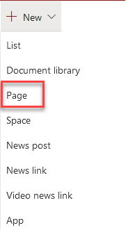
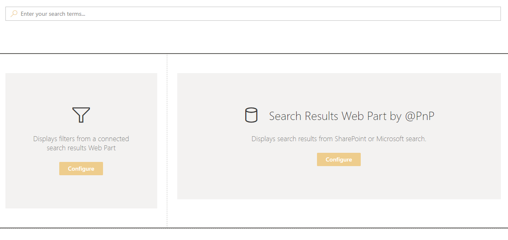
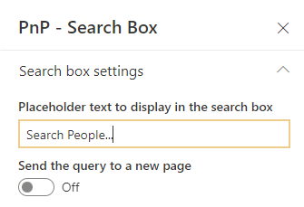
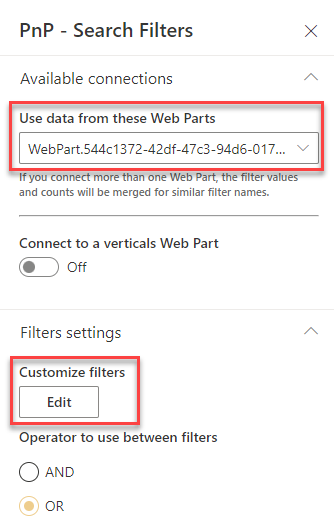
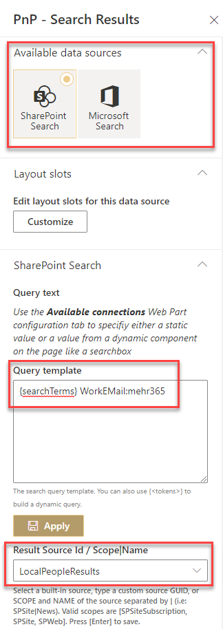
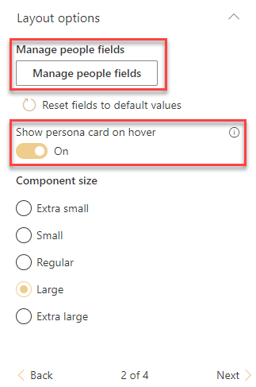
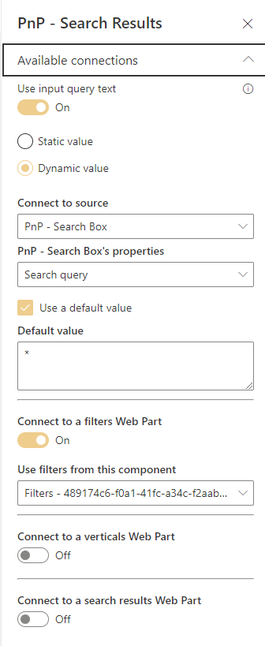
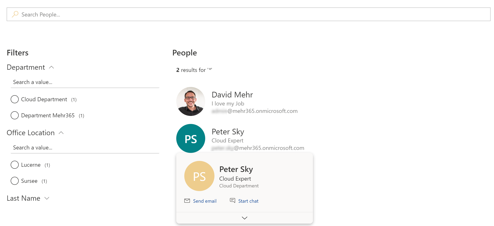

# Create a useful People Search

!!! note
    The PnP Modern Search Web Parts must be deployed to your App Catalog and activated on your site. See the [installation documentation](../installation.md) for details.

This scenario describes how to configure a People Search with the PnP Modern Search Web Parts. You can search people in the Search Box or use filters with the Filters Web Part. With the defined layouts you can show your People Results with relevant information about the person. It's a basic configuration for a useful People Search, the PnP Web Parts have a lot more settings to configure.

## Create a new SharePoint page
To add the Search Web Parts, you must first create a new modern SharePoint page. We will be configure this new page as a search page with the PnP Modern Search Web Parts.

## Add PnP Search Web Parts
On the newly created page, add the PnP Modern Search Web Part Search Box, Search Filters and Search Results. 

The WebParts can be arranged and configured on the page as desired.

## Configure Search Box
You can change the placeholder text to display in the Search Box, you can leave the default configuration for the other settings.

## Configure Search Filters
Connect your Search Filters Web Part to the existing Results Web Part under "Use data from these Web Parts" and customize filters with your own properties.

### Customize filters
Add your own filter properties to the Search Filters. This are the properties from the UPS (= SharePoint User Profile Service), check the propertiy settings in your SharePoint Search Schema.

## Configure Search Results
Use the SharePoint Search as source and configure the Search Results Web Part to show only people. Choose the existing default result source LocalPeopleResults. With the query template you can exclude admin oder system accounts. In this example, only show user with an email addess this contains mehr365.

### Layout configuration
It is a predefined people layout available for the people search. Use People as Search Results layout.

## Layout options
In the section layout options you can manage the people fields, that will be showing in the results. When you like an people hover card, then activate this option, but you need to activate API access for Microsoft Graph in your SharePoint admin center. Use also an component size for your results.

### Web Part Connections
As the last step, activate the connections. Use the query from your configured Search Box, you can also configure a default value. Connect your Search Results also to the Filters Web Part.

## Solution
After the configuration i have a useful People Search incl. Hover card, with basic configuration. You have a lot more filter and layout options that you can configure.

