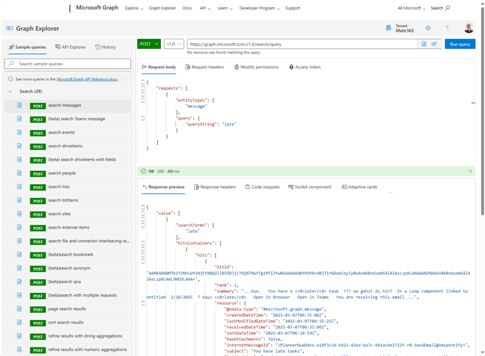
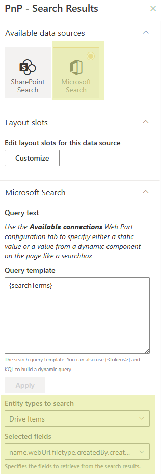
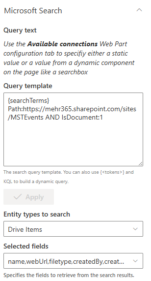
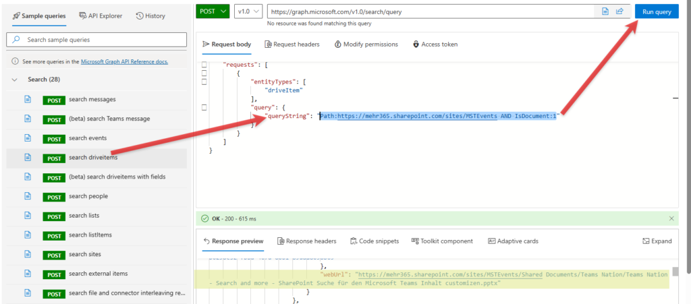
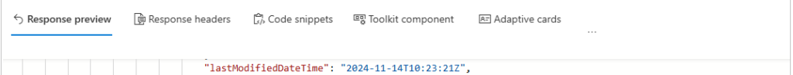
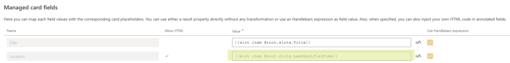

# Use Microsoft Search as data source in a search page

!!! note
    The PnP Modern Search Web Parts must be deployed to your App Catalog and activated on your site. See the [installation documentation](../installation.md) for details.
    
This scenario describes how the Microsoft Search data source can be used to retrieve additional results from M365 for search purposes.

## Microsoft Graph API
Microsoft Graph offers the ability to search and display not only SharePoint content, but also additional data from M365 apps, including Teams messages and Outlook emails. Microsoft Graph is constantly being developed and integrated into many of the M365 apps that can be queried using search endpoints.
By using the Microsoft Search data source, additional data from M365 can be made available in the search. However, as in the SharePoint Search data source, KQL and the existing options in the WebParts can be used for configuration.

### Microsoft Graph Endpoints
The [Graph Explorer](https://developer.microsoft.com/graph/graph-explorer) can be used to check the available Graph Endpoints. The entities for the Endpoint Search can be used in the PnP Modern Search WebParts. The provided endpoints can be started directly using a sample query (Request body – Run query) and the search result (Response preview) can be checked with all properties.

## Configure Microsoft Graph in the results WebPart
To get started with Microsoft Graph in the PnP Modern Search WebParts, select Microsoft Search as the data source. The corresponding settings for configuring the entity will then be available.

See more in the full Microsoft documentation: [Use the Microsoft Search API to query data](https://learn.microsoft.com/graph/api/resources/search-api-overview?view=graph-rest-1.0&WT.mc_id=DX-MVP-5004845)

## Configure the result WebPart with the Microsoft Search data source
When using the Microsoft Search data source, both KQL and query variables can be used as query text. No separate syntax is required to display elements in the search.

As an example, using the Microsoft Search data source and the Drive Items entity (files, folders, pages, and news from SharePoint and OneDrive), all documents from the site /sites/MSTEvents are displayed:

{searchTerms} Path:https://<TENANT>.sharepoint.com/sites/MSTEvents AND IsDocument:1

To check what Graph actually returns, you can use the Graph Explorer again:

## Using Graph properties in the search layout
The properties of Microsoft Graph can also be displayed in the layouts. To do this, a layout slot must be defined for each property used. The properties to be used can also be identified via the Graph Explorer.

In the PnP Results WebPart (page 1), a layout slot must now be created for the corresponding property.
– Slot name: LastModifiedTime
– Slot field: resource.lastModifiedDateTime (from Graph)

The layout slot can now be used in the Cards Layout, for example. In the Layout options, an existing slot can be used under Managed card fields and the value can be adjusted accordingly with the layout slot just created.

{{slot item @root.slots.LastModifiedTime}}

